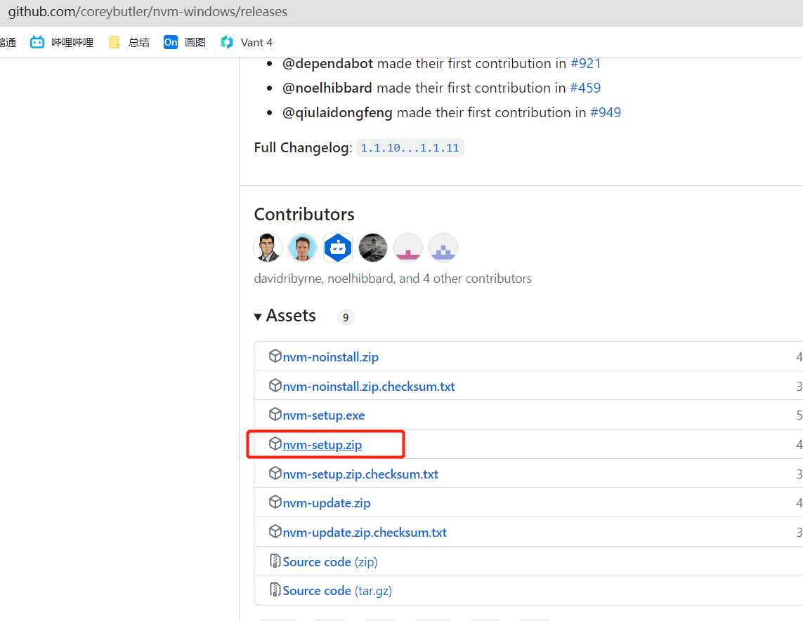
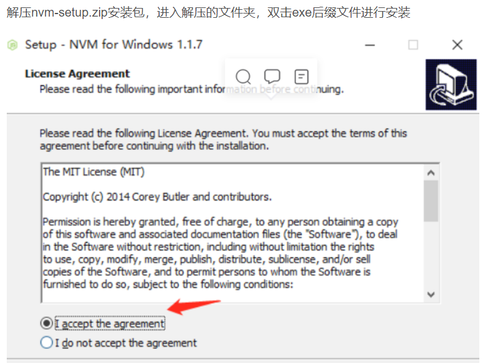
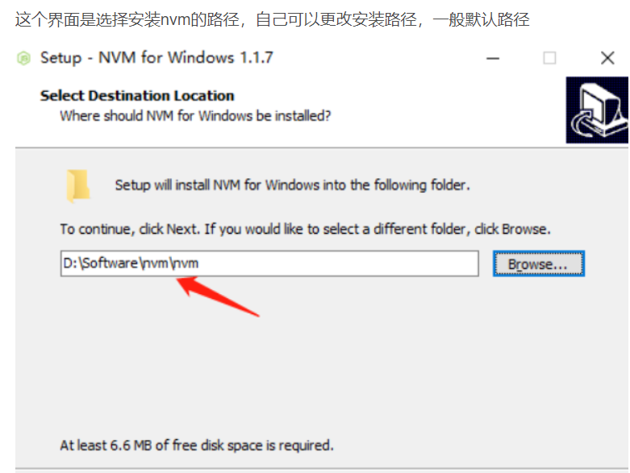
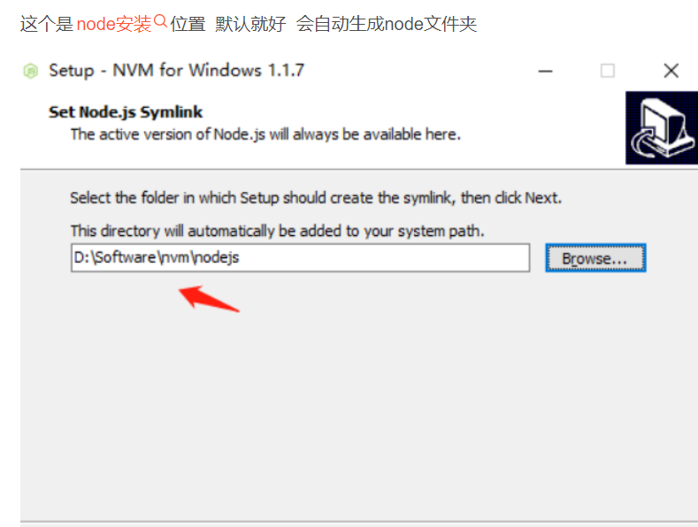
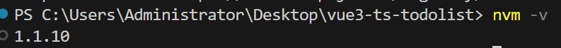
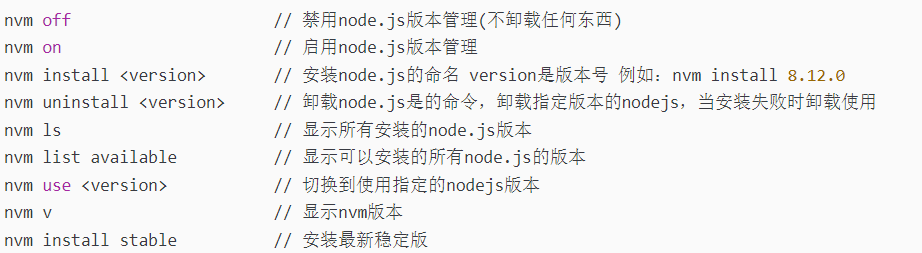

# nvm 的使用 nvm 可以快速的切换 nodejs 的版本

## nvm 是什么？

nvm 是一个 node 的版本管理工具，可以简单操作 node 版本的切换、安装、查看。。。等等，与 npm 不同的是，npm 是依赖包的管理工具。
nvm 下载安装
安装之前需要先把 自己电脑上边的 node 给卸载了!!!! 很重要

下载地址：https://github.com/coreybutler/nvm-windows/releases

由于 github 有的同学打不开 所以下载好了 大家直接拿到就是

安装完毕后输入 nvm -v 查看版本。这样 nvm 就已经安装完成了

nvm 的基本使用

# nrm 的使用 可以快速切换下载镜像

1. 介绍
   nrm(npm registry manager) 是 npm 的镜像源管理工具. 有时候国外资源太慢,使用 nrm 可以快速的在 npm 源之间切换
2. 安装
   npm install -g nrm
3. 基本使用

- 查看可选择的源
  nrm ls
- 切换到对应的镜像源
  nrm use 对应的镜像
- 删除镜像源
  nrm del 名字
- 增加镜像源
  nrm add registry http://registry.npm.frp/trmap.cn/
- 测试镜像源速度
  nrm test npm

# rimraf 快速的删除 node_modules

